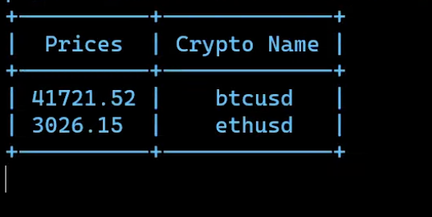

# CryptoCurrency Value Generator
Gives the value of the cryptocurrency inputted in form of a table (prettytable package). It refreshes after every 3 seconds. Additionally, api_key is an environment variable that has to be inputted before running main.py. It uses the iexcloud api. 

# Instructions on Running: 
 1. Set the environment variable like : set api_key= {whatever is the token} 
 2. Then : python3 main.py

# Image: 

